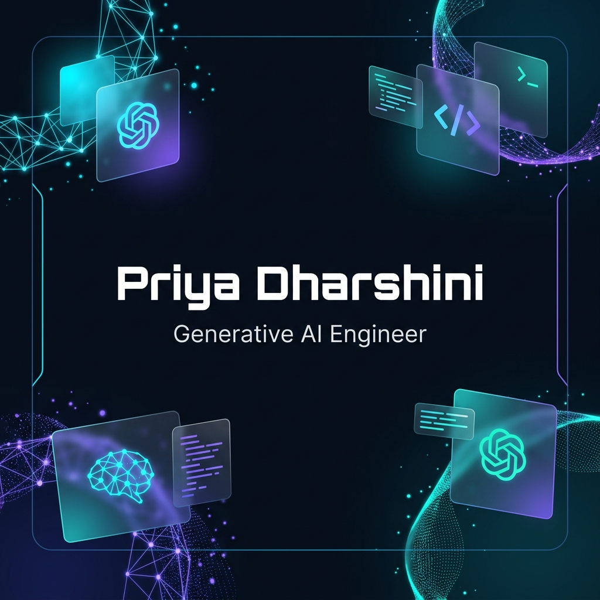
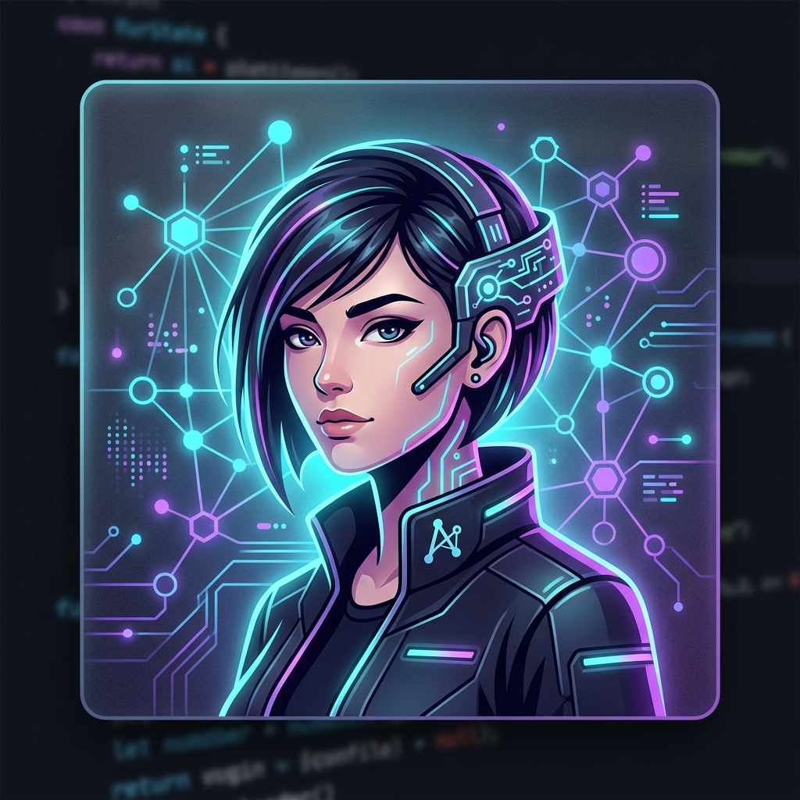

<!--
  WORLD-CLASS GITHUB PROFILE README
  Theme: Cyberpunk Glassmorphism / AI Dark Mode
  Author: Priya Dharshini
-->

<p align="center">
  <!-- Large Animated Hero Banner -->
  <a href="https://github.com/YOUR_GITHUB_USERNAME">
    
  </a>
</p>

<p align="center">
  <!-- Animated Typing Roles SVG -->
  
</p>

---

<p align="center">
  
</p>

## ⚡ Executive Summary & Introduction

I am a final-year Computer Science Engineering student at **Jaya Engineering College** (graduating in 2027), specializing in the engineering and orchestration of production-ready Generative AI systems. 

My work centers on constructing resilient **autonomous multi-agent architectures**, optimizing high-throughput **Retrieval-Augmented Generation (RAG) pipelines**, and developing local **Model Context Protocol (MCP)** tools. Guided by the philosophy that *AI is a cognitive amplifier meant to augment, not replace, human capacity*, I translate theoretical AI research into performant, clean-code software engineering patterns.

---

## 👤 Executive Profile

```python
class PriyaDharshini:
    def __init__(self):
        self.name = "Priya Dharshini"
        self.role = "Full Stack Developer"
        self.education = "B.E. Computer Science & Engineering"
        self.college = "Jaya Engineering College"
        self.graduation_year = 2027
        self.location = "India"
        self.skills = ["RAG", "FastAPI", "Next.js","React", "Node.js", "Python", "SQL", "MongoDB"]
        
    def get_current_focus(self):
        return {
            "learning": ["AI Agents", "LangGraph", "Model Context Protocol (MCP)"],
            "interests": ["Cognitive Architectures", "Multi-Agent Systems", "AI-augmented UX"]
        }
        
    def get_career_goals(self):
        return {
            "immediate": "Build real-world, enterprise-ready AI products",
            "long_term": "Design robust, self-improving cognitive systems at scale",
            "dream_companies": ["OpenAI", "Google DeepMind", "Anthropic", "Vercel", "NVIDIA"]
        }

    def fun_fact(self):
        return "I debug LLM hallucination rates over filter coffee ☕"
```

---

## 🎯 Current Engineering Focus

<div align="center">
  <table>
    <tr>
      <td>🤖 <b>AI Agents (LangGraph / Autogen)</b></td>
      <td>🔌 <b>Model Context Protocol (MCP)</b></td>
    </tr>
    <tr>
      <td>🔍 <b>Advanced RAG Architectures</b></td>
      <td>⚙️ <b>Multi-Agent Orchestration</b></td>
    </tr>
    <tr>
      <td>🏋️ <b>LLM Fine-tuning & Distillation</b></td>
      <td>🧪 <b>Prompt Engineering & Eval Frameworks</b></td>
    </tr>
    <tr>
      <td>🦾 <b>AI Automation Systems</b></td>
      <td>🏠 <b>Edge LLMs & Local Inference (Ollama)</b></td>
    </tr>
  </table>
</div>

---

## 🛠️ Technology Stack

### 💻 Core Languages
<p align="left">
  
  
  
  
</p>

### 🧠 AI & Machine Learning
<p align="left">
  
  
  
  
  
  
  
  
  
</p>

### ⚙️ Backend & Database
<p align="left">
  
  
  
  
  
  
</p>

### 🎨 Frontend & Design
<p align="left">
  
  
  
  
</p>

### ☁️ Deployment & Operations
<p align="left">
  
  
  
  
</p>

---

## 🚀 Featured Engineering Projects

<table width="100%">
  <tr>
    <td width="50%" valign="top">
      <h3>🤖 COHORT</h3>
      <p><i>High-Performance Multi-Agent Collaborative Workspace</i></p>
      <p>A real-time workspace that coordinates multiple specialized AI agents. Leverages LangGraph to handle conversational state and dynamically solve coding and reasoning tasks.</p>
      <p>
        
        
        
      </p>
      <p>
        <a href="https://github.com/YOUR_GITHUB_USERNAME/cohort"></a>
        <a href="YOUR_COHORT_DEMO_URL"></a>
      </p>
    </td>
    <td width="50%" valign="top">
      <h3>🏥 HANex</h3>
      <p><i>AI-Driven Medical Image Diagnosis Analysis</i></p>
      <p>An clinical analyzer using fine-tuned Vision-Language Models to process X-rays/scans, highlight anomalies, and generate structured diagnostic reports in PDF format.</p>
      <p>
        
        
        
      </p>
      <p>
        <a href="https://github.com/YOUR_GITHUB_USERNAME/hanex"></a>
        <a href="YOUR_HANEX_DEMO_URL"></a>
      </p>
    </td>
  </tr>
  <tr>
    <td width="50%" valign="top">
      <h3>📄 Resume Filter AI</h3>
      <p><i>Intelligent ATS Parsing & Alignment Agent</i></p>
      <p>Uses semantic similarity search over embeddings to parse, score, and rank CVs. Provides developers/recruiters detailed gap analysis against complex JDs.</p>
      <p>
        
        
        
      </p>
      <p>
        <a href="https://github.com/YOUR_GITHUB_USERNAME/resume-filter-ai"></a>
        <a href="YOUR_RESUME_FILTER_DEMO_URL"></a>
      </p>
    </td>
    <td width="50%" valign="top">
      <h3>♻️ Waste Identifier</h3>
      <p><i>Edge Computer Vision Waste Classifier</i></p>
      <p>A real-time CNN model optimized for edge devices that classifies waste types (plastics, paper, organic) for automated recycling sorting systems.</p>
      <p>
        
        
        
      </p>
      <p>
        <a href="https://github.com/YOUR_GITHUB_USERNAME/waste-identifier"></a>
        <a href="YOUR_WASTE_IDENTIFIER_DEMO_URL"></a>
      </p>
    </td>
  </tr>
  <tr>
    <td width="50%" valign="top">
      <h3>🔍 Research AI Assistant</h3>
      <p><i>Autonomous Scientific Citation & Digest Engine</i></p>
      <p>A multi-agent system running on Model Context Protocol (MCP) that automatically fetches, analyzes, and diagrams citation paths for new ML publications.</p>
      <p>
        
        
        
      </p>
      <p>
        <a href="https://github.com/YOUR_GITHUB_USERNAME/research-ai-assistant"></a>
        <a href="YOUR_RESEARCH_ASSISTANT_DEMO_URL"></a>
      </p>
    </td>
    <td width="50%" valign="top">
      <h3>🎨 NFT Marketplace</h3>
      <p><i>Decentralized Web3 Asset Exchange</i></p>
      <p>A secure, responsive NFT marketplace supporting minting, trading, and contract-based auctions of digital assets with clean frontend flows.</p>
      <p>
        
        
        
      </p>
      <p>
        <a href="https://github.com/YOUR_GITHUB_USERNAME/nft-marketplace"></a>
        <a href="YOUR_NFT_MARKETPLACE_DEMO_URL"></a>
      </p>
    </td>
  </tr>
  <tr>
    <td colspan="2" align="center" valign="top">
      <h3>🚀 Future Project: Autonomous AI SaaS Platform</h3>
      <p><i>Zero-Code Application Generation via LLM Multi-Agent Orchestration</i></p>
      <p>A unified cognitive fabric that accepts a simple text prompt, spins up a virtual Scrum team (PM, Architect, Coder, QA), runs automated tests inside sandboxed Docker containers, and deploys the fully functional app directly to Vercel/Render.</p>
      <p>
        
        
        
        
      </p>
    </td>
  </tr>
</table>

---

## 📈 GitHub Insights & Statistics

<p align="center">
  <!-- Trophies -->
  <a href="https://github.com/ryo-ma/github-profile-trophy">
    
  </a>
</p>

<p align="center">
  <!-- Stats & Languages side-by-side -->
  
  &nbsp;&nbsp;&nbsp;&nbsp;
  
</p>

<p align="center">
  <!-- Streak and Activity side-by-side -->
  
  &nbsp;&nbsp;&nbsp;&nbsp;
  
</p>

---

## 🏆 Key Achievements

<table width="100%">
  <tr>
    <td width="33%" align="center" valign="top">
      <h3>🏆 Hackathons</h3>
      <p><b>National Winner</b></p>
      <p>Smart India Hackathon 2025</p>
      <p><i>Built edge waste-sorting computer vision automation.</i></p>
    </td>
    <td width="33%" align="center" valign="top">
      <h3>🌟 Leadership</h3>
      <p><b>GDG Student Lead</b></p>
      <p>Google Developer Groups Club</p>
      <p><i>Mentored 200+ students on building LLM agents and web apps.</i></p>
    </td>
    <td width="33%" align="center" valign="top">
      <h3>📜 Certifications</h3>
      <p><b>DeepLearning.AI</b></p>
      <p>TensorFlow Developer & LangChain Specialist Certificate</p>
    </td>
  </tr>
</table>

---

## 🗺️ Learning Timeline

```
  ┌─────────────────────────────────────────────────────────────┐
  │  2024 - Core Foundations                                    │
  │  └─ Python Development, OOP, DS&A, and Classical Web Dev    │
  └──────────────────────────────────────────────┬──────────────┘
                                                 │
                                                 ▼
  ┌─────────────────────────────────────────────────────────────┐
  │  2025 - Full Stack & Machine Learning                       │
  │  └─ React/Next.js, FastAPI, SQL/NoSQL databases, & PyTorch  │
  └──────────────────────────────────────────────┬──────────────┘
                                                 │
                                                 ▼
  ┌─────────────────────────────────────────────────────────────┐
  │  2026 - LLMs & Cognitive Architectures                      │
  │  └─ RAG, LangChain, Autogen, and Advanced Prompt Eng.       │
  └──────────────────────────────────────────────┬──────────────┘
                                                 │
                                                 ▼
  ┌─────────────────────────────────────────────────────────────┐
  │  2027 - Generative AI Engineer (Graduation)                 │
  │  └─ Multi-Agent Orchestration, LangGraph, and Local LLMs   │
  └─────────────────────────────────────────────────────────────┘
```

---

## 💡 Engineering Philosophy

> "AI should not replace human agency, but expand it. The goal of a Generative AI Engineer is to engineer systems that turn complex cognitive processes into predictable, reproducible, and accessible software primitives."
>
> — *Priya Dharshini*

---

## 🐍 Contribution Activity Graph

<p align="center">
  <!-- Contribution Snake Animation generated by the GitHub Action -->
  
</p>

---

## 🤝 Connect With Me

<p align="center">
  <a href="https://github.com/YOUR_GITHUB_USERNAME">
    
  </a>
  <a href="YOUR_LINKEDIN_URL">
    
  </a>
  <a href="YOUR_PORTFOLIO_URL">
    
  </a>
  <a href="mailto:YOUR_EMAIL_ADDRESS">
    
  </a>
  <a href="YOUR_TWITTER_URL">
    
  </a>
  <a href="YOUR_LEETCODE_URL">
    
  </a>
  <a href="YOUR_HACKERRANK_URL">
    
  </a>
</p>

---

<p align="center">
  <!-- Visitor Counter -->
  
</p>

<p align="center">
  <!-- Loop wave footer -->
  
</p>

<p align="center">
  Made with ⚡ and ☕ by Priya Dharshini • © 2026
</p>
